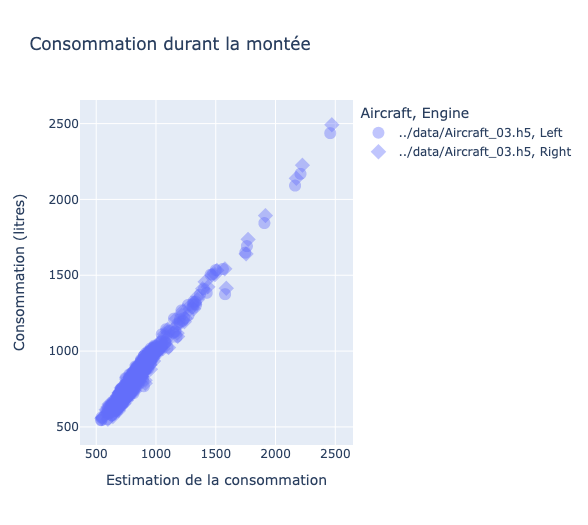

# BackLog

_Ce fichier contient le suivi des travaux de l'équipe projet._


## 1. 10/11/2023 

* Présentation du cours, description du projet.
* Quelques cas d'études en analyse de données.

## 2. 17/11/2023

* Présentation des données. Création du dictionnaire des variables [Fichier readme](../README.md).
* Discussion autour du format HDF5 et de la toolbox tabata.
* Préparation de l'installation d'un environnement Python local.

## 3. 24/11/2023

* Cours sur Git, VSCode.
* Lecture et nettoyage des données.

## 4. 01/12/2023

* Analyse descriptive globale des données de vol.
* Premiers affichages des consommations globales en fonction de la durée des vols.

## 5. 08/12/2023

* Cours sur le processus CRISP-DM.
* Formalisation de l'affichage en plotly de la consommation globale en fonction de la durée de vol.


_Figure 1. Représentation de la consommation en fonction de la durée du vol. Les avions sont représentés par des couleurs et les moteurs par un rond (moteur gauche) et un carré (moteur droit)._


_Figure 2. Si la relation précédente semble très bien approximée par une relation linéaire on remarque cependant qu'il reste une forte variance de presque 30% de la valeur nominale de la consommation pour une durée donnée._

* Remarque sur l'extraction de phase de vol.
> L'utilisation de la vitesse Mach n'est pas forcément suffisante. Il faudrait entrer plus dans le détail du takeoff.


_Figure 3. Sur ce graphique on montre que le moteur commence à monter en régime bien avant que l'avion commence à avancer._

## 6. 15/12/2023

_Travail individuel à domicile._.

## 7. 22/12/2023

Récupération des travaux réalisés par Dinh sous la forme de deux fonctions codées dans le module `utils.py`.

* `detect_phase(...)` prend en entrée un DataFrame et renvoie une liste de couples d'index de débutet fin de phase de vol dans l'ordre de la séquence de vol : taxi1 (out), climb, cruise, descend, taxi2 (in).

* `get_consumption(...)` prend en entrée un itérateur sur un fichier avion (par exemple un Opset) et produit en sortie une table contenant les colonnes suivantes : 

        ['Aircraft', 'Engine', 'Flight', 'Phase duration', 'Alt_max', 'Mach_max', 'Total consumption', 'Consumption volume'].

Les deux dernières colonnes représentent:
+ Total consumption : le poids (en kg) de fuel consommé par l'avion durant la phase de vol sélectionnée.
+ Consumption volume : le volume de fuel (en litres) utilisé par ce moteur.

## 8. 12/01/2024

Réalisation d'un modèle de consommation par phase de vol. On a aussi testé l'exploitation d'indicateurs supplémentaire à la phase de vol.

Par phase :
* Apprentissage sur un moteur.
* Test sur un autre moteur.

La variance de l'erreur de prédiction a l'air d'être bien réduite. 

La régression suivante porte sur la consommation pendant la montée et s'appuie sur la durée, l'altitude maximale et la vitesse maximale.

```
 OLS Regression Results                            
==============================================================================
Dep. Variable:            Consumption   R-squared:                       0.967
Model:                            OLS   Adj. R-squared:                  0.967
Method:                 Least Squares   F-statistic:                 1.965e+04
Date:                Wed, 17 Jan 2024   Prob (F-statistic):               0.00
Time:                        19:08:15   Log-Likelihood:                -9502.0
No. Observations:                1998   AIC:                         1.901e+04
Df Residuals:                    1994   BIC:                         1.903e+04
Df Model:                           3                                         
Covariance Type:            nonrobust                                         
==============================================================================
                 coef    std err          t      P>|t|      [0.025      0.975]
------------------------------------------------------------------------------
Intercept   -148.7303     20.045     -7.420      0.000    -188.042    -109.418
Duration    1531.0342      7.621    200.907      0.000    1516.089    1545.979
Alt_max        0.0068      0.000     18.295      0.000       0.006       0.008
Mach_max     412.9565     39.021     10.583      0.000     336.429     489.484
==============================================================================
Omnibus:                      258.137   Durbin-Watson:                   0.916
Prob(Omnibus):                  0.000   Jarque-Bera (JB):              776.224
Skew:                          -0.666   Prob(JB):                    2.79e-169
Kurtosis:                       5.748   Cond. No.                     2.67e+06
==============================================================================

Notes:
[1] Standard Errors assume that the covariance matrix of the errors is correctly specified.
[2] The condition number is large, 2.67e+06. This might indicate that there are
strong multicollinearity or other numerical problems.
```

Le modèle linéaire peut-être encore amélioré car on a clairement des dépendances entre variables et une variance qui dépend de la consommation.



Des questions se sont posées concernant le poids de l'avion. L'utilisation de la consommation globale ne peut être exploitée pour estimer cette même consommation. Par contre, pour une phase de vol spécifique, la consommation globale à laquelle devrait s'ajouter une constante correspondant au poids de l'avion et une autre pour palier aux risque de détournement peut être utilisée comme estimation du poids de l'avion au décollage. Typiquement, ce poids devrait être utile pour l'estimation du fuel flow (instantané) réduit de la masse consommée à chaque instant.
Néanmoins nous observons que cette variable est très peu informative sur les phases prises séparément.

> Il faut désormais calculer le gain en précision entre un modèle global et un modèle phase par phase. 

## 9. 19/01/2024

* Julia propose de démarrer le template sous OverLeaf.
* Dung advances on the indicators and adds it in the get_consumption function. Get an idea of the importance of each indicator during each phase.
* Achille crée la table de synthèse et commence à programmer un modèle multiphases.
* Khalifa complète les statistiques avec des indicateurs relatifs et teste un modèle unique basé sur des indicateurs par phase.

## 10. 26/01/2024

