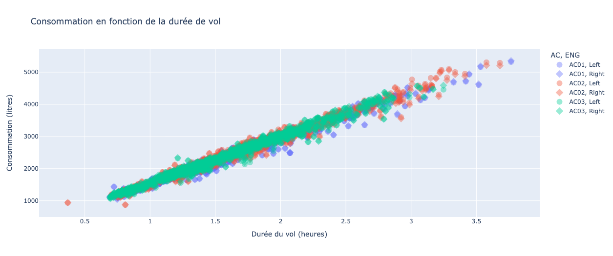

# BackLog

_Ce fichier contient le suivi des travaux de l'équipe projet._

## 1. 10/11/2023 

* Présentation du cours, description du projet.
* Quelques cas d'études en analyse de données.

## 2. 17/11/2023

* Présentation des données. Création du dictionnaire des variables [Fichier readme](../README.md).
* Discussion autour du format HDF5 et de la toolbox tabata.
* Préparation de l'installation d'un environnement Python local.

## 3. 24/11/2023

* Cours sur Git, VSCode.
* Lecture et nettoyage des données.

## 4. 01/12/2023

* Analyse descriptive globale des données de vol.
* Premiers affichages des consommations globales en fonction de la durée des vols.

## 5. 08/12/2023

* Cours sur le processus CRISP-DM.
* Formalisation de l'affichage en plotly de la consommation globale en fonction de la durée de vol.

_Figure 1. Représentation de la consommation en fonction de la durée du vol. Les avions sont représentés par des couleurs et les moteurs par un rond (moteur gauche) et un carré (moteur droit)._

_Figure 2. Si la relation précédente semble très bien approximée par une relation linéaire on remarque cependant qu'il reste une forte variance de presque 30% de la valeur nominale de la consommation pour une durée donnée._

* Remarque sur l'extraction de phase de vol.
> L'utilisation de la vitesse Mach n'est pas forcément suffisante. Il faudrait entrer plus dans le détail du takeoff.

_Figure 3. Sur ce graphique on montre que le moteur commence à monter en régime bien avant que l'avion commence à avancer._

## 6. 22/12/2023

Récupération des travaux réalisés par Dinh sous la forme de deux fonctions codées dans le module `util.py`.

* `detect_phase(...)` prend en entrée un DataFrame et renvoie une liste de couples d'index de débutet fin de phase de vol dans l'ordre de la séquence de vol : taxi1 (out), climb, cruise, descend, taxi2 (in).

* `get_consumption(...)` prend en entrée un itérateur sur un fichier avion (par exemple un Opset) et produit en sortie une table contenant les colonnes suivantes : 

        ['Aircraft', 'Engine', 'Flight', 'Phase duration', 'Alt_max', 'Mach_max', 'Total consumption', 'Consumption volume'].

Les deux dernières colonnes représentent:
+ Total consumption : le poids (en kg) de fuel consommé par l'avion durant la phase de vol sélectionnée.
+ Consumption volume : le volume de fuel (en litres) utilisé par ce moteur.
