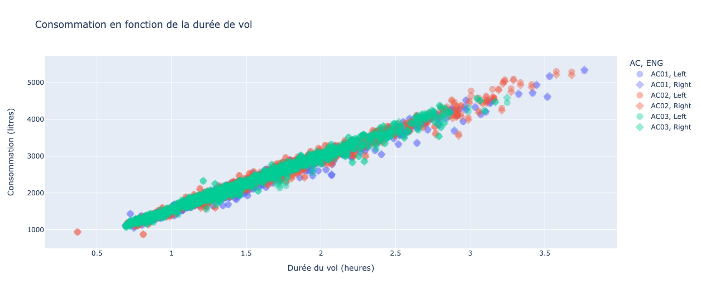

# 
A baseline model for turbojet engine fuel consumption

Julia Carbo1, Dinh Quang Dung1, Achile Ngeuessiek1, Khalifa Michel Ouattara1, Jérôme Lacaille1,2

 

1 <em>Université Sorbonne Paris Nord</em>

2 <em>Safran Aircraft Engines</em>

## Commentaires
Je propose que dans ce draft on mette les remarques tant qu'on a pas accès à OverLeaf.

> Mettre mon nom (Jérôme Lacaille) en dernier car je ne suis que encadrant. Vous pouvez éventuellement me mettre en co-auteur, mais ce n'est pas une obligation.

### 2 Méthodology

> "The study employs the dataset in [1] containing 3 datasets with around 1000 flights each", rajouter le fait que ces données sont anonymisées et banalisées et ne peuvent plus être mise en relation avec vols réels.

#### 2.1 Data Evaluation.

> Table 1. Mettre la légende de chaque Table au dessus du tableau. Ce sont les légendes des figures qui sont en dessous.

> Figure 1. Rajouter la source de la figure.

> "In particular the anti-ice system acts where the engine’s power is attenuated through the implementation of hot air sampling.", c'est l'utilisation de l'anti-ice qui réduit la puissance du moteur.
> Remplacer par quelque chose comme : "Note that when anti-icing is active, the engine loses power."

#### 2.2 Data Treatment with Python

Le début de ce chapitre n'est pas fondamental.

La fin du chapitre peut se réintégrer au sein du paragraphe précédent pour annoncer l'étude.

#### 2.3 First approach

> Dans la première équation replacer les valeurs numériques par les noms des constantes qui sont décrites ensuite.

> Noter peut-être quelque part que l'on ne prend pas en compte le changement de la densité du fuel avec la température et la pression, on ne regarde la consommation qu'une fois au sol avec une valeur moyenne standard.

> "The first approach to check the validity of the model...", Il faut expliquer qu'ion a remarqué que la variabilité de l'erreur état pratiquement du même ordre de grandeur que la mesure de consommation, aussi on s'intéresse à un indicateur relatif comme l'écart-type divisé par la moyenne.

> La variable dépendante, le facteur, c'est la durée, ce qui est logique. La consommation est la cible.

> "The model's coefficients...", mettre moins de précision dans les chiffres et donner les unités.

> Figure 5, si l'idée vous intéresse, pour le calcul de l'enveloppe et observant les valeurs proches en prédiction, il faudrait expliquer l'algorithme.

En général, penser toujours à donner plus de détail dans les légendes.

> Table3, légende au dessus. Attention, ce n'est peut-être pus le même algorithme.

#### 2.4 Study of each phase

> Figure 6, coquille altitud(e).

Il faut choisir un indicateur de précision relative dans le chapitre précédent et le reprendre sur chaque phase dans celui-ci.

### 3 Variations on fuel consumption

> Figure 8, Garder les mêmes affichages du tube de confiance.

Penser à construire une table globale pour une analyse causale.

# Acien draft.

## Abstract.

The aviation industry has joined forces within the Air Transport Action Group (ATAG) to converge on zero-carbon operations by 2050. One of the key factors in the generation of carbon dioxide is fuel combustion. This will certainly involve replacing fossil fuels with hydrogen or sustainable aviation fuels (SAF). But for several years now, engine manufacturers have been successfully reducing fuel consumption with the help of increasingly advanced technologies, such as the use of ceramic components (CMC) for hot parts, additive manufacturing of complex parts, and carbon fibers to lighten blades and carter. The LEAP, Safran's latest turbojet engine for medium-range aircraft, consumes 15% less fuel than the previous CFM56 engines powering the Boeing 737 and most Airbus A320 series. Current consumption is known to be around 2 liters per 100 kilometers per passenger.

Designing more efficient engines is not the only way to reduce fuel consumption. A very important factor is the way the aircraft is flown.
Engineers are working on physical and numerical models to identify the most critical phases of flight, and suggest good piloting practices and more suitable routes.
These models are complicated because it is important to be able to interpret each result in order to infer new rules. This work does not present one of these models, but proposes a rough numerical baseline on which it will be possible to base the qualification of more complex technical solutions. Once this model has been built, we'll have a hypothesis about the standard behavior of an aircraft, and by observing deviations from this behavior we'll be able to identify particular missions with either excessive or below-normal fuel consumption.

## Introducing the problem

We have 3 data sets, each corresponding to an aircraft of the same type. Each set contains around 1000 successive flights, with measurements made on both engines.
Flights are therefore stored in tables with the number of seconds elapsed since the ECU was powered up as the time index, and a series of measurements made during the flight as the columns.
During each flight, aircraft data is recorded, as well as measurements made on each of the two engines. 
Some measurements are taken at different positions in the engine, called stations, like pressures and temperatures. Station 1 is the air intake and station 5 is the exhaust nozzle. The measurements of particular interest to us for this work are described in the table below.

<em>Table 1. List of a few interest variables.</em>

| Variable [unité] | Description |
|:---------|:------------|
| ALT [ft] | Altitude |
| TAT [deg C] | Total Air Température (measured by the aircraft sensor) |
| M [Mach] | Mach |
| NAIV_# [bool] | Anti Ice Vanne |
| P0_# [psia] | Pression en entrée |
| Q_# [lb/h] | Fuel flow |
| TLA_# [deg] | Level Angle |
| T_OIL_# [deg C] | Oil temperature |

The following figure shows an example of conventional flight.

<em>Figure 1. This plot shows a classic civil flight in cold condiions. The red bottom line is the altitude (in feet) of the aircraft and the top blue line corresponds to a booleand that indicates if anti-ice is on.</em>

The flight consists mainly of 5 phases: a driving phase (taxi) at the begining and at the end of the flight, a climb phase, a cruise phase and a descent phase.
In this project we are only interested in flight proper therefore in the three main phases: climb, cruise and descent. 
In Figure 1, a special case of the anti-ice system has been presented which decreases the power of the engine by hot air sampling. This measure is important because it is a factor of augmentation in consumption. This flight uses the anti-ice in takeoff and landing because the two airports had to be in temperature and humidity winter conditions.

## Methodology

We will create a model of prediction of global consumption, control its robustness by a cross validation process and study its precision.Then it will be possible to look at which flights that consume more or month than normal by binaryly quantifying the prediction residues.

### A first elementary model based on the duration of the flight

A first idea, elementary, is to look at consumption according to the duration of the flight.It is a first logical approximation.The following image (Figure 2) gives the result of the linear prediction.

<em>Figure 2. Regression of the overall consumption of the three planes over the duration of each flight. Each plane is represented by a color and the two engines are distinguished by circles and diamonds.</em>

Le résultat est clairement linéaire, et vu de loin semble assez précis, mais en observant de plus près, on s'apperçoit que la précision est de l'ordre de la consommation elle-même.

### Etude de chaque phase

## Results

## Conclusion

## References